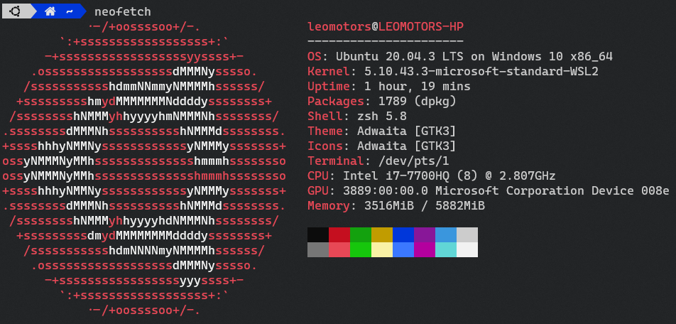
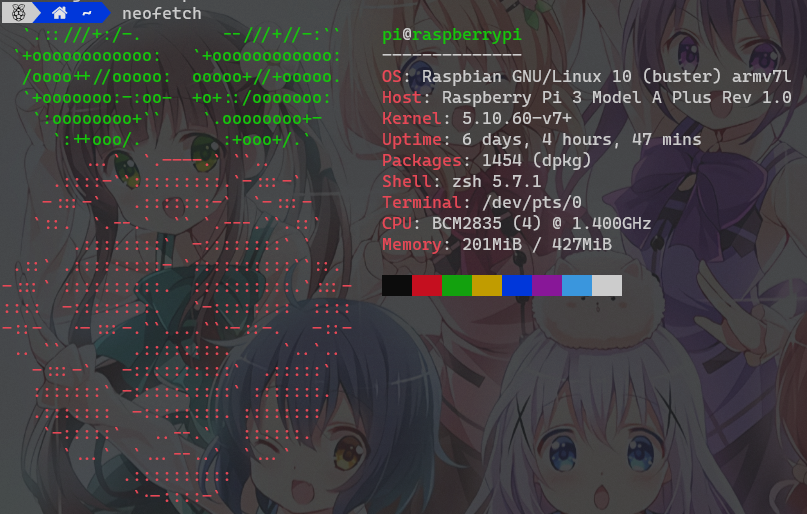

# My dotfiles

Is this a trend? why everyone includes dotfiles in their repo

idk why but I'm gonna do it too

dotfiles of my system, _Clone or Fork not recommended_

## My Main System : Ubuntu

**Host OS**: Windows 11 21H2

**Linux OS**: Ubuntu 20.04.3 LTS

**Terminal**: Windows Terminal

This is my main System for Programming

### wslfetch

### neofetch

## My Raspberry Pi

**Model**: Raspberry Pi 3 Model A+

**OS**: Raspbian 10

I use my raspberry pi to run 4 Discord Bots simultaneously

_pls ignore background_

