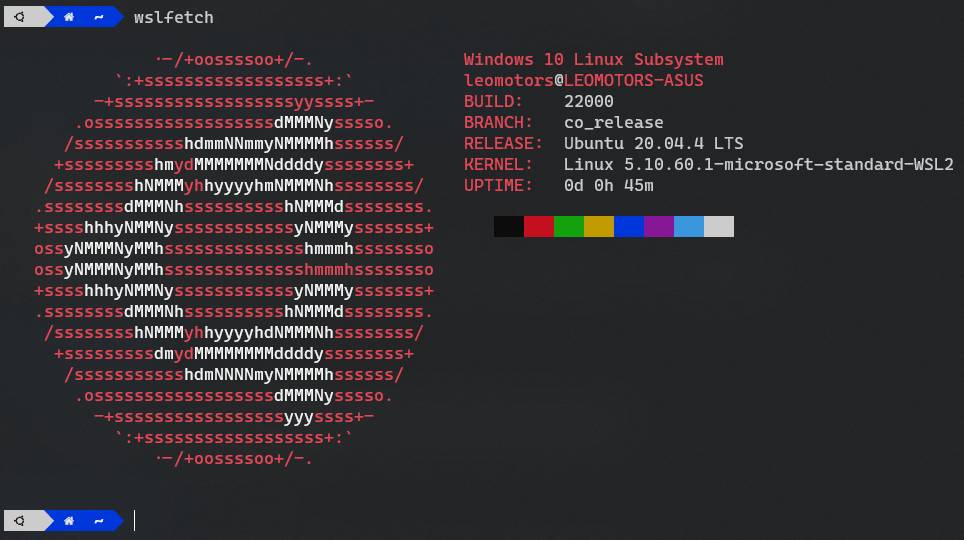
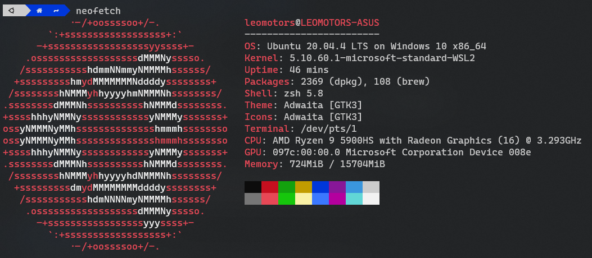
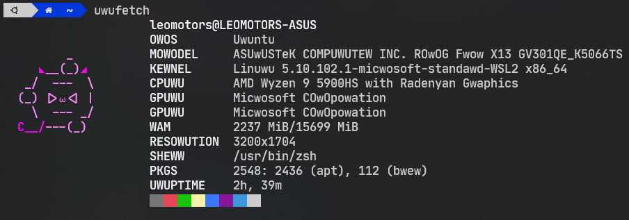
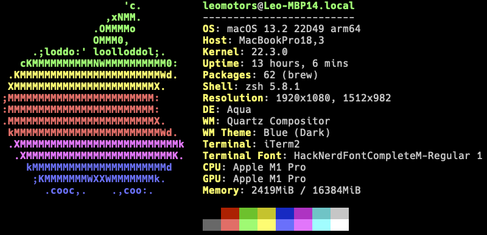
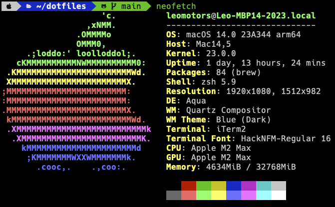
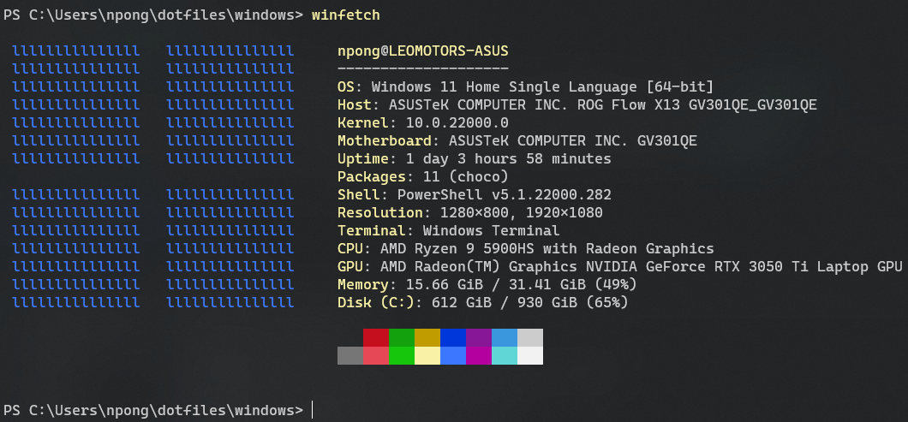
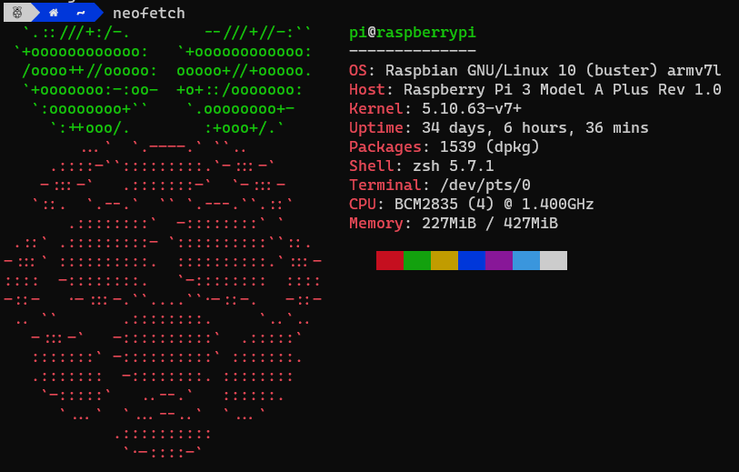

# My dotfiles

Is this a trend? why everyone includes dotfiles in their repo

idk why but I'm gonna do it too

dotfiles of my system, _Clone or Fork not recommended_

## (Was) My Main System for Coding : Ubuntu

_no longer used since I have macbook_

**OS**: Ubuntu 22.04 LTS

**Host**: Windows 11 22H2 (10.0.22623)

**Terminal**: Windows Terminal (Best Terminal in Windows)

### wslfetch

_Note: Image outdated, lazy to update_

### neofetch

_Note: Image outdated, lazy to update_

### uwufetch ([Personalized Forked Version by me](https://github.com/Leomotors/uwufetch))

_Note: Image outdated, lazy to update_

## My previous primary system for Coding : Macbook Pro 14 2021

_company laptop, so if I resign (or get fired) F_

edit: I got fired

**Spec**: M1 Pro 8 Cores (6P/2E), RAM 16GB SSD 512GB

### neofetch

## My current primary system for Coding : Macbook Pro 14 2023

**Spec**: M2 Max 12 Cores (8P/4E) GPU 30 Cores, RAM 32GB SSD 1TB

### neofetch

## Another System: Windows

_host of my linux_

**OS**: Windows 11 22H2

I used this for some programming tasks that is better to do on Windows.

Ex. Mobile App, ~~THICC~~ Visual Studio and desktop app for Windows (of course)

### winfetch

## Laptop Spec

| Key        | Value                                                                          |
| ---------- | ------------------------------------------------------------------------------ |
| Model Name | ASUS ROG Flow X13                                                              |
| Model No.  | GV301QE-K5066TS                                                                |
| CPU        | AMD Ryzen 9 5900HS with Radeon Graphics                                        |
| GPU        | NVIDIA RTX 3050 Ti (35W) 4GB                                                   |
| Memory     | LPDDR4 4266MHz 32 GB                                                           |
| Storage    | SSD 1 TB                                                                       |
| Connection | WiFi 6 Bluetooth 5.2                                                           |
| Full Spec  | [Link](https://rog.asus.com/th/laptops/rog-flow/2021-rog-flow-x13-series/spec) |

## My Raspberry Pi

**Model**: Raspberry Pi 3 Model A+

**OS**: Raspbian 10

Bought with the price of 1000 Baht

I used my raspberry pi to run _many_ Discord Bots simultaneously but now it is no longer powered, my personal vm replaced its job.

## PS

According to experiences of setting up linux. The scripts in `*/scripts` never work. lmao
