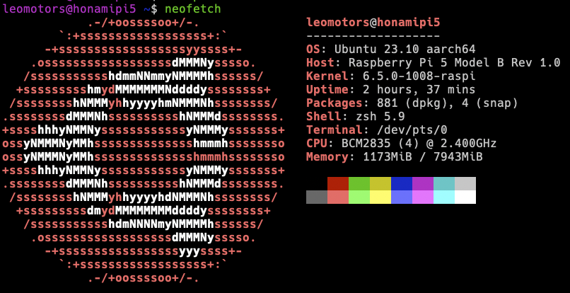

# My dotfiles

> Is this a trend? why everyone includes dotfiles in their repo  
> idk why but I'm gonna do it too

dotfiles of all my system, feel free to look for inspiration

## Benchmark

Geekbench score of all my systems are at my Geekbench account: https://browser.geekbench.com/user/245833

## My current primary system for Coding : Macbook Pro 14 2023

**Spec**: M2 Max 12 Cores (8P/4E) GPU 30 Cores, RAM 32GB SSD 1TB  
**Geekbench Device Name**: MacBook Pro (14-inch, 2023)  
**Geekbench 6 Score**: 2650/14500

*bought one month before M3 Max got released*

### neofetch

## My Raspberry Pi 5 as an on-premise server

**Spec**: RAM 8 GB, Sandisk Ultra 256GB (SD Card Score: https://pibenchmarks.com/benchmark/76386)  
**OS**: Ubuntu Server 23.10  
**Geekbench Device Name**: Raspberry Pi 5 Model B Rev 1.0  
**Geekbench 6 Score**: 750/1550

### neofetch

# Obsolete VPS

Did not commit dotfiles of these systems to this repo because I forgor

## Contabo VPS S

My cloud VPS for running discord bots and hosting website. Will be replaced by Raspberry Pi 5 soon.

It is very cheap and I recommend you if you don't care much about reliability.

Last Price: 4.5 EUR/month (Black Friday Promotion)

**Spec**: 4 vCPU Cores, 8 GB RAM, 200 GB SSD  
**Geekbench Device Name**: Contabo VPS S (QEMU Standard PC (i440FX + PIIX, 1996))  
**Geekbench 6 Score**: 900/2500

## Azure VM (b2s)

Last Price: 12.86 USD/month (inc vat, 3 years reservation discount)

Cancelled because it is too expensive (and will be much more expensive because my Azure Students expired and not eligable for next year)

# Obsolete Devices

## My ASUS Windows Laptop

**Geekbench Device Name**: ASUSTeK COMPUTER INC. ROG Flow X13 GV301QE  
**Geekbench 6 Score**: 1800/7000 (Consume lots of power because it is Ryzen 9)

### Laptop Spec

| Key        | Value                                                                          |
| ---------- | ------------------------------------------------------------------------------ |
| Model Name | ASUS ROG Flow X13                                                              |
| Model No.  | GV301QE-K5066TS                                                                |
| CPU        | AMD Ryzen 9 5900HS with Radeon Graphics                                        |
| GPU        | NVIDIA RTX 3050 Ti (35W) 4GB                                                   |
| Memory     | LPDDR4 4266MHz 32 GB                                                           |
| Storage    | SSD 1 TB                                                                       |
| Connection | WiFi 6 Bluetooth 5.2                                                           |
| Full Spec  | [Link](https://rog.asus.com/th/laptops/rog-flow/2021-rog-flow-x13-series/spec) |

### winfetch

## WSL Ubuntu: My former main coding system

_no longer used since I got macbook_

**OS**: Ubuntu 22.04 LTS  
**Host**: Windows 11 22H2 (10.0.22623)  
**Terminal**: Windows Terminal (Best Terminal in Windows)

### wslfetch

_Note: Image outdated, lazy to update_

### neofetch

_Note: Image outdated, lazy to update_

### uwufetch ([Personalized Forked Version by me](https://github.com/Leomotors/uwufetch))

_Note: Image outdated, lazy to update_

## My previous macbook : Macbook Pro 14 2021

_company laptop, so if I resign (or get fired) F_

edit: I got fired

**Spec**: M1 Pro 8 Cores (6P/2E), RAM 16GB SSD 512GB
**Geekbench Device Name**: MacBook Pro (14-inch, 2021)  
**Geekbench 6 Score**: 2350/10000

### neofetch

## My Old Raspberry Pi

I used my raspberry pi to run _many_ Discord Bots simultaneously.  
It was replaced by cloud vm.  
and then I back to use Raspbery Pi again.

**Model**: Raspberry Pi 3 Model A+  
**OS**: Raspbian 10  
**Geekbench Score**: *it cannot even complete the test*

Bought with the price of 1000 Baht

