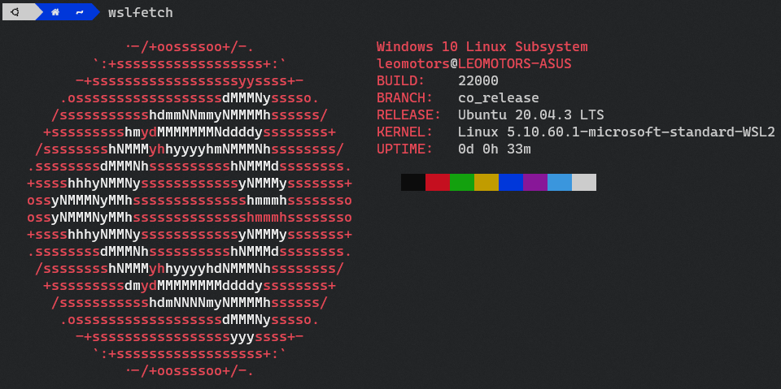
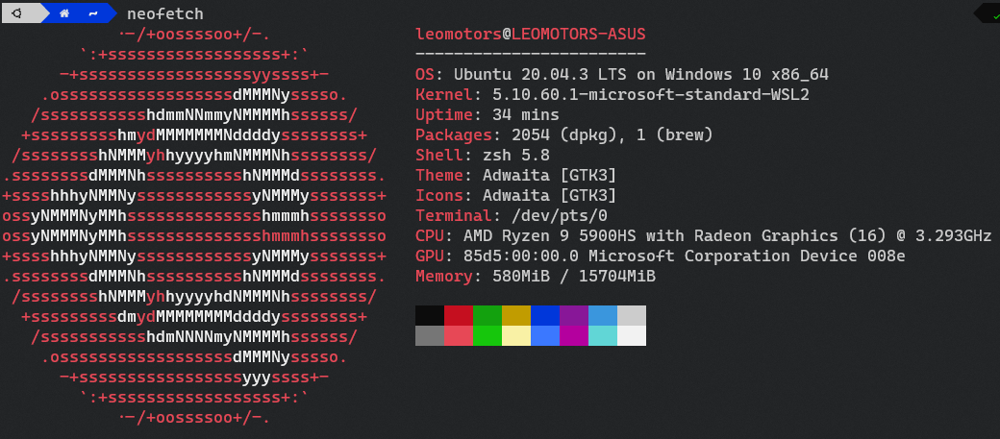

# My dotfiles

Is this a trend? why everyone includes dotfiles in their repo

idk why but I'm gonna do it too

dotfiles of my system, _Clone or Fork not recommended_

## My Main System : Ubuntu

**Host OS**: Windows 11 21H2

**Linux OS**: Ubuntu 20.04.3 LTS

**Terminal**: Windows Terminal

This is my main System for Programming

### wslfetch

### neofetch

## My Secondary System: Windows

_basically host of my linux_

**OS**: ~~Buggy~~ Windows 11 21H2

I used this for some programming tasks (like compiling RTX 2090 TiFy for Windows but program itself is developed in Linux) or pygame which face issues with Linux (not sure because it is Linux or it is VM that cause the issues) or other tasks that it is hard to do in Linux (VM)

No dotfiles exists in Windows (of course, everybody know this)

## My Raspberry Pi

**Model**: Raspberry Pi 3 Model A+

**OS**: Raspbian 10

I use my raspberry pi to run 5 Discord Bots simultaneously

_pls ignore background_

